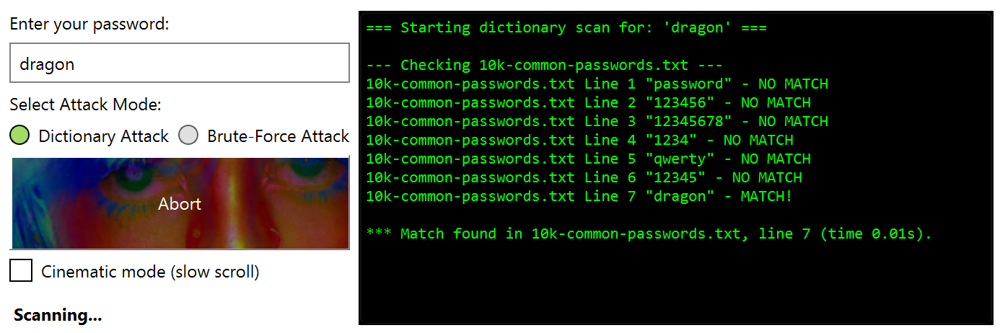

# Educational-Password-Tester
GUI tool demonstrating password testing mechanics and brute‑force estimation in Python using PyQt6

## Features
- Dictionary attack simulator scanning multiple 'wordlists' files
- Brute‑force estimator with character set math and time computation
- Cinematic mode for slow terminal‑style line output
- Threaded processing
- Real‑time console window and result summary
- Fully educational — no real cracking performed
## Quick Start
Clone the repo:
```bash
git clone https://github.com/ColdVisionzz/Educational-Password-Tester.git
cd Educational-Password-Tester
pip install PyQt6
python tester/password_tester.py
```
## License
[MIT](LICENSE)